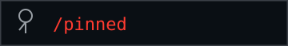
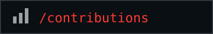
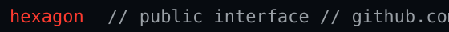

 

<table width="100%">
<tr>
<td width="25%" align="center">

</td>
<td width="25%" align="center">

</td>
<td width="25%" align="center">

</td>
<td width="25%" align="center">

</td>
</tr>
</table>

 

